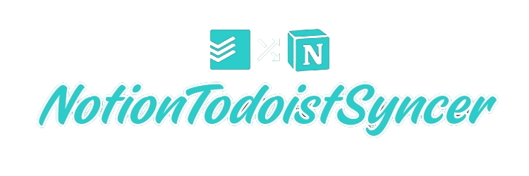

[](https://github.com/gregyjames/notion_todoist_syncer/actions/workflows/python-app.yml)
[](https://github.com/gregyjames/notion_todoist_syncer/actions/workflows/docker-image.yml)

[](https://github.com/psf/black)

[](https://app.codacy.com/gh/gregyjames/notion_todoist_syncer/dashboard?utm_source=gh&utm_medium=referral&utm_content=&utm_campaign=Badge_grade)




A self-hosted bidirectional sync tool for Notion and Todoist to eliminate the need for paid services like Zapier, IFTTT, and 2Sync. This solution was designed for personal use, combining my preference for Notion's powerful database capabilities with Todoist's ease of use for task management. By simplifying the process, I no longer need to navigate Notion's interface just to add a new task, streamlining my workflow effectively.

## Setup
### config.json
```json
{
"todoist_api_key": "",
"notion_api_key": "",
"database_id": "",
"project_id": "",
"notion_status_tag_name": "Status",
"notion_done_status": "Completed",
"notion_default_status": "Next Up",
"cron": "*/5 * * * *"
}
```
- #### Values
	- database_id: The ID of the database to use.
	- project_id: The project id to use in todoist.
	- notion_status_tag_name: Select tag name on notion task in database.
	- notion_done_status: The select tag value for a completed task in notion.
	- notion_default_status: Default notion task status for new task (i.e which column in kanban).
	- cron: Runs every 5 minutes.
## Todo

- [x] Todoist-To-Notion
  - [x]   Deleted Notes
  - [x]   Completed Notes
  - [x]   New notes
    - [x] Title
    - [x] Content
    - [x] Due date
    - [x] Priority
  - [ ] Note property changes        
- [ ] Notion-To-Todoist
  - [ ]   Deleted Notes
  - [ ]   Completed Notes
  - [ ]   New notes
    - [ ] Title
    - [ ] Content
    - [ ] Due date
    - [ ] Priority
- [x] Refactor and Clean up code
- [ ] Improve performance
- [x] Cron sync loop
- [x] Sync Reports (i.e failure/success/total/new)
- [x] Switch to SQLite over TinyDB for note sync cache
- [x] Package into container

## License 
MIT License

Copyright (c) 2024 Greg James

Permission is hereby granted, free of charge, to any person obtaining a copy
of this software and associated documentation files (the "Software"), to deal
in the Software without restriction, including without limitation the rights
to use, copy, modify, merge, publish, distribute, sublicense, and/or sell
copies of the Software, and to permit persons to whom the Software is
furnished to do so, subject to the following conditions:

The above copyright notice and this permission notice shall be included in all
copies or substantial portions of the Software.

THE SOFTWARE IS PROVIDED "AS IS", WITHOUT WARRANTY OF ANY KIND, EXPRESS OR
IMPLIED, INCLUDING BUT NOT LIMITED TO THE WARRANTIES OF MERCHANTABILITY,
FITNESS FOR A PARTICULAR PURPOSE AND NONINFRINGEMENT. IN NO EVENT SHALL THE
AUTHORS OR COPYRIGHT HOLDERS BE LIABLE FOR ANY CLAIM, DAMAGES OR OTHER
LIABILITY, WHETHER IN AN ACTION OF CONTRACT, TORT OR OTHERWISE, ARISING FROM,
OUT OF OR IN CONNECTION WITH THE SOFTWARE OR THE USE OR OTHER DEALINGS IN THE
SOFTWARE.
